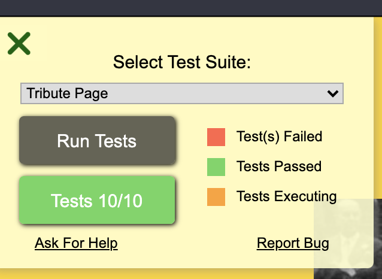

This is Anna Macdonald's completion of [FreeCodeCamp's tribute page project](https://www.freecodecamp.org/learn/responsive-web-design/responsive-web-design-projects/build-a-tribute-page).

This project passed all FreeCodeCamp's tests:

You can preview [my Vicki Draves page here](https://annafirtree.github.io/tribute_page/).

I chose Vicki Draves because she was the subject of a Google Doodle on the day I did this project. 
